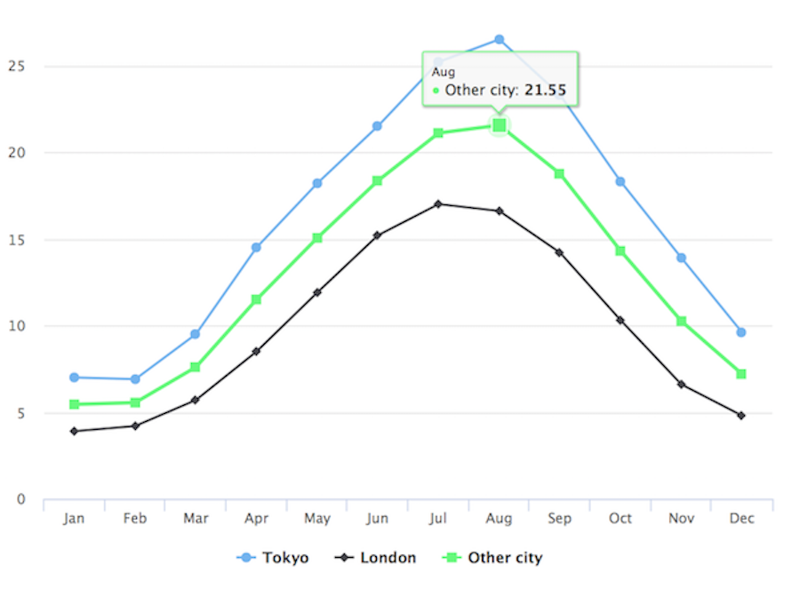

```{r setup, include=FALSE}
knitr::opts_chunk$set(echo = TRUE, error=FALSE, message=FALSE, fig.height = 5, fig.width = 5)
```

```{r echo=FALSE}
library("ggplot2")
library("magick")
library("highcharter")
library("leaflet")
library("plotly")
```

## Workshop goals 

* learn about various packages for making data visualizations in R 
* be able to determine which package to use 
* understand basic syntax for the popular packages
* learn basic design principles for effective communication
* gain hands-on practice making different visualization types

## What is R?

R is a software environment for statistical computing and graphics. Using R you can do rigorous statistical analysis, clean and manipulate data, and create publication-quality graphics.


*clustering map*

## Popularity of R 


Source: Stephen Cass, ["The 2016 Top Programming Langauges"](http://spectrum.ieee.org/computing/software/the-2016-top-programming-languages), IEEE Spectrum

## R packages 

Packages are programs that you import into R to help make tasks easier. The most popular R packages for working with data include *dplyr, stringr, tidyr, and ggplot2*. 

## How to find a package

There's no easy way (yet) for new R users to find R packages that they might need. People are working on this problem. In the meantime, consult the following list or ask a Librarian!

Resources include: 

* Google ("Top R packages for ....")
* Looking at trending R packages on [rdocumentation.org](https://www.rdocumentation.org/trends)

## Popular R packages for data viz 

* ggplot2
* ggvis
* htmlwidgets (for interactive web visualizations):
  * highcharter
  * leaflet
  * plotly
* shiny

## Core R functions for plotting

You can create graphs in R without installing a package, but packages will allow you to create better visualizations that are any of the following:

* attractive
* publication-quality
* interactive

## ggplot2

ggplot2 is the most popular visualization package for R. It's the best all-purpose package for creating many types of 2-dimensional visualizations. 


[Source: r-statistics.co](http://r-statistics.co/Top50-Ggplot2-Visualizations-MasterList-R-Code.html)

## highcharter
highcharter is an R package known as an htmlwidget, which allows you to use popular Javascript packages for visualization in R. Free unless you are using it for a commercial or government purpose.

```{r eval= FALSE}
data(citytemp)

hc <- highchart() %>% 
  hc_xAxis(categories = citytemp$month) %>% 
  hc_add_series(name = "Tokyo", data = citytemp$tokyo) %>% 
  hc_add_series(name = "London", data = citytemp$london) %>% 
  hc_add_series(name = "Other city",
                data = (citytemp$tokyo + citytemp$london)/2)

hc
```


  
## leaflet

```{r eval=FALSE}
m <- leaflet(options = leafletOptions(zoomControl = FALSE, dragging=FALSE, minZoom = 15, maxZoom = 15)) %>%
  addTiles() %>%  # Add default OpenStreetMap map tiles
  addMarkers(lng=-78.6697, lat=35.7876,
    popup="Hello World!")
m  # Print the map

```
  


## plotly

```{r eval=FALSE}
p <- plot_ly(economics, x = ~date, y = ~unemploy / pop)
p
```


## Deciding on the right package

* static or interactive
* single viz or dashboard
* the nature of the data: geospatial? quantitative? qualitative? 
* purpose and licensing

#### Recommended packages

* 2D vizzes: **ggplot2** 
* 3D vizzes: **rgl** 
* maps: **leaflet**
* interactive: **ggvis, rbokeh, plotly, or highcharter**
* network graphs: **diagrammeR, visNetwork**
* web applications: **shiny**

## ggplot2: the most important package to learn first

**ggplot2** was created on the principles of the **Layered Grammar of Graphics** (2010), by Hadley Wickham and based of off work from Wilkinson, Anand, & Grossman (2005) and Jaques Bertin (1983). 

Essentially: graphs are like sentences you can construct, and they have a grammar. The grammar of graphics consists of the following: 

at least one layer: 

   + data & aesthetic mapping of the data to variables
   + a statistical transformation
   + geometric object (geom) -- point, line, bar, etc
   + position adjustment

scale   
coordinate system  
facet (optional)

*These components make up a graph.*

## Open script.R file

Download the following file: **[script.R](https://drive.google.com/open?id=0Bz7G_jKybSBsUXlzTGZoVlpYQlU)**
Click the blue download button  
Open RStudio. 
File > Open File...   
Select the **script.R** file that you just downloaded  (probably in your Downloads folder)
Click Open  

## Get to know the data
Let's see an example of a simple graph created with ggplot. We are going to use the **mpg** data set about different cars and their properties. 

#### Exercise #1: In your script file, run **?mpg** to learn more about this dataset. To run the code, highlight it and then click Run. (shortcut keys: Mac: command + Enter, Windows: CTRL + Enter)

#### Exercise #2: Run **head(mpg)** to see the first few rows of the data.

```{r}
head(mpg)
```

## Exercise #3: ggplot syntax

The graph below uses ggplot2 to look for correlation between a car's engine displacement and highway mileage.

* `library(ggplot2)`: loads the ggplot2 library

* `ggplot()` : function that tells R that you want to make a graph with ggplot

* `data = mpg` : says that you want to use the mpg dataset (sample data that comes with R)

* `geom_point()`: function that says you want to make a scatterplot

* `mapping = aes()`: function that allows you to map data variables to X and Y axes

**Run the following code in your script file:**
```{r}
ggplot(data = mpg) + 
  geom_point(mapping = aes(x = displ, y = hwy))
```


## Exercise #4: Practice
Make a scatterplot with `cyl` mapped to the x-axis and `hwy` mapped to the y-axis.

```{r echo=FALSE}
ggplot(data= mpg) + geom_point(mapping = aes(x=cyl, y=hwy))
```

## Solution to #4
```{r eval=FALSE}
ggplot(data= mpg) + geom_point(mapping = aes(x=cyl, y=hwy))
```

## Exercise #5: Mapping a variable to color

Make a scatterplot of `disp`=x and `hwy`=y with class mapped to the `color` aesthetic. Run:
```{r}
ggplot(data = mpg) + 
  geom_point(mapping = aes(x = displ, y = hwy, color = class))
```

## Exercise #6: Make the same scatterplot as the previous example, but map drv to color.
```{r echo=FALSE}
ggplot(data = mpg) + 
  geom_point(mapping = aes(x = displ, y = hwy, color = drv))
```

## Solution to #6
The type of drive system the car has (4-wheel, rear-wheel, and front-wheel) is mapped to color.
```{r eval=FALSE}
ggplot(data = mpg) + 
  geom_point(mapping = aes(x = displ, y = hwy, color = drv))
```

## Exercise #7: Aesthetic parameters

Variables can be mapped to the following aesthetic parameters. If you are publishing in b/w, and can't use color, you might want to use size or shape:

* `color`
* `size`
* `shape`
* `alpha` - transparency

**Substitute another aesthetic in place of `color`. Run the code:**
```{r eval=FALSE}
ggplot(data = mpg) + 
  geom_point(mapping = aes(x = displ, y = hwy, color = drv))

```

## Exercise #8: Faceting

Facets are a way to create multiple smaller charts, or subplots, based on a variable. Run this code to see what faceting does:
```{r}
ggplot(data = mpg) + 
  geom_point(mapping = aes(x = displ, y = hwy)) + 
  facet_wrap(~ class, nrow = 2)
```

## Exercise #9: Practice Faceting. 

**Substitute `class` for another variable in the dataset. Ex: `trans`, `drive`, or `cyl`**
```{r eval=FALSE}
ggplot(data = mpg) + 
  geom_point(mapping = aes(x = displ, y = hwy)) + 
  facet_wrap(~ class, nrow = 2)
```

## Exercise 10: facet_grid

Facet grids allow for an extra dimension of faceting. Run this code in your script to see what facet_grid() does:
```{r}
ggplot(data = mpg) + 
  geom_point(mapping = aes(x = displ, y = hwy)) + 
  facet_grid(drv ~ cyl)
```

## Apply what you have learned

Now create a new scatter plot with the dataset `diamonds` using ggplot2. Refer to previous code examples for assistance.

```{r}
head(diamonds)
```


## Example: 

```{r}
ggplot(data = diamonds) + 
  geom_point(mapping = aes(x = carat, y = price, color=cut)) + facet_wrap(~cut, nrow=2)
```

